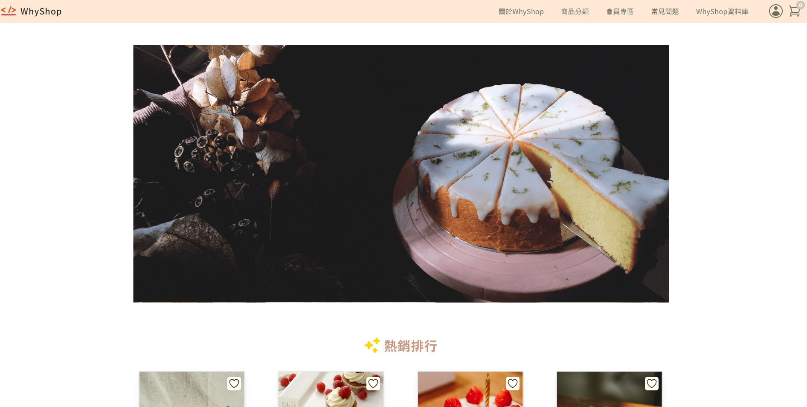

<h1 align="center">WhyShop Project</h1>

  
  
  
  
  

<h2>
<a href="https://nocodenolife.net/siaosiao/page/">
 demo here
</a>
</h2>

## 📄 Description

This project is a custom-built e-commerce platform, leveraging the power of Vue 3 and Vuex for state management, styled with TailwindCSS for modern, responsive design. Built on Vite, it offers a fast and efficient development experience. The codebase maintains high standards of code quality and consistency, managed by ESLint and Prettier.

**Key Features:**
- Vite: Employs the latest version of Vite for swift development and optimized build processes.
- Vue 3: Utilizes Vue 3 for a reactive and composable application architecture.
- Vuex: Integrated for state management across the e-commerce platform.
- TailwindCSS: Implements TailwindCSS for utility-first styling and responsive design.
- ESLint + Prettier: Combined to enforce code quality and consistent styling.

## 🚀 Features

- Vue.js Framework: The core framework driving the application's user interface.
- Code Quality Tools: ESLint and Prettier integration for maintaining high code standards.
- No Database Dependency: Simplifies setup as no database configuration is required.

## 📦 Setup & Development Server

1. Installation: Clone the repository and run `npm install` to install dependencies.
2. Development: Run `npm run dev` to start the development server with hot module replacement.
3. Open `http://localhost:8000/` in your browser.
